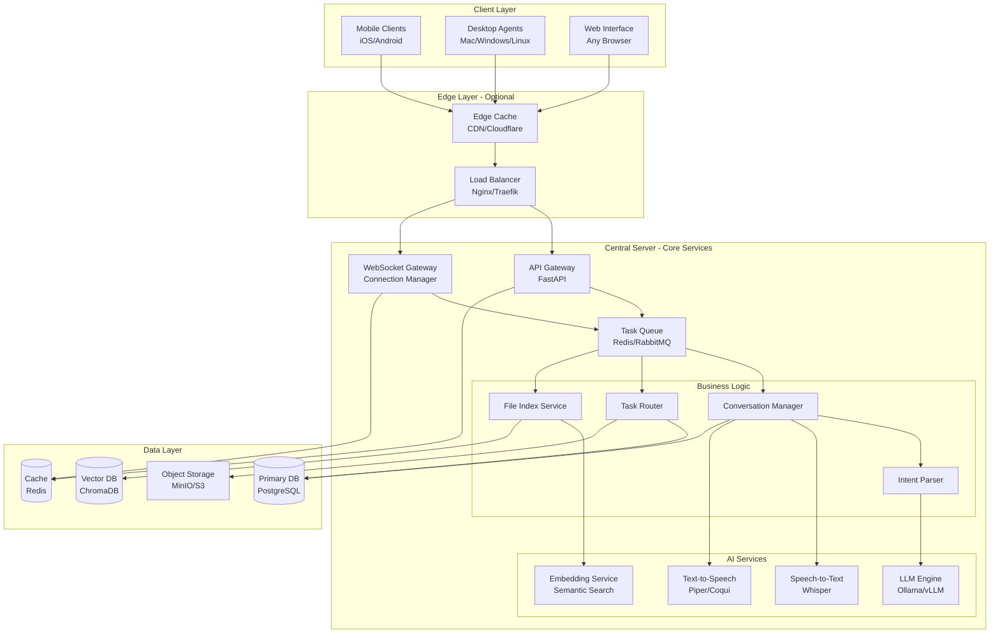

# 🏗️ Jarvis Hybrid Ecosystem Architecture
## Production-Grade, Scalable, Multi-Device AI System

> [!IMPORTANT]
> **Design Philosophy**: Zero-cost foundation with clear upgrade paths. Built for reliability, scalability, and privacy.

**Vision**: A self-hosted, privacy-first AI ecosystem that scales from a single laptop to distributed cloud infrastructure.

**Current Target**: Windows Laptop (8GB RAM) → Future: Multi-node cluster with auto-scaling

---

## 📐 System Architecture Overview

### High-Level Architecture



---

## 🧩 Core Components - Detailed Specifications

### 1. Central Server (The Brain)

#### A. API Gateway (FastAPI)
**Responsibilities**:
- RESTful API endpoints for CRUD operations
- Request validation and sanitization
- Rate limiting and throttling
- API versioning (`/v1/`, `/v2/`)
- Health checks and metrics exposure

**Endpoints**:
```
POST   /v1/auth/register          - Device registration
POST   /v1/auth/token             - JWT token generation
GET    /v1/devices                - List all devices
GET    /v1/files/search           - Search files across devices
POST   /v1/commands/execute       - Execute command on device
GET    /v1/conversations/{id}     - Get conversation history
POST   /v1/voice/transcribe       - STT endpoint
```

**Scalability**:
- Stateless design (session in Redis)
- Horizontal scaling with load balancer
- Request queuing for backpressure management

---

#### B. WebSocket Gateway (Connection Manager)
**Responsibilities**:
- Persistent bidirectional connections with all devices
- Device presence tracking (online/offline/away)
- Real-time event broadcasting
- Connection pooling and heartbeat monitoring
- Automatic reconnection with exponential backoff

**Connection Protocol**:
```json
// Client → Server (Heartbeat)
{"type": "ping", "device_id": "mac-macbook", "timestamp": 1706280000}

// Server → Client (Command)
{"type": "command", "id": "cmd-123", "action": "find_file", "params": {"name": "report.pdf"}}

// Client → Server (Response)
{"type": "response", "cmd_id": "cmd-123", "status": "success", "data": {...}}
```

**Scalability**:
- WebSocket server clustering with Redis pub/sub
- Sticky sessions via load balancer
- Connection limits per node (configurable)

---

#### C. Task Queue (Redis/RabbitMQ)
**Purpose**: Decouple request handling from execution for reliability and scalability.

**Queue Types**:
1. **High Priority**: Voice commands, user interactions (< 1s latency)
2. **Normal Priority**: File operations, searches (< 5s latency)
3. **Low Priority**: Background indexing, cleanup (best effort)
4. **Dead Letter Queue**: Failed tasks for retry/analysis

**Message Format**:
```json
{
  "task_id": "task-uuid",
  "type": "execute_command",
  "priority": "high",
  "device_id": "mac-macbook",
  "payload": {...},
  "retry_count": 0,
  "max_retries": 3,
  "timeout": 30
}
```

**Scalability**:
- Multiple worker processes consuming from queue
- Auto-scaling workers based on queue depth
- Task result caching in Redis

---

#### D. Conversation Manager
**Responsibilities**:
- Maintain dialogue state across devices
- Context window management (last N messages)
- Clarification handling (ambiguity resolution)
- Multi-turn conversation tracking
- User preference learning

**State Management**:
```python
ConversationState = {
    "conversation_id": "conv-123",
    "user_id": "vishw",
    "active_device": "iphone-vishw",
    "context_window": [...],  # Last 10 messages
    "pending_clarification": {
        "question": "Which presentation?",
        "options": ["Q4_Report.pptx", "Demo.pptx"],
        "timeout": 60
    },
    "learned_preferences": {
        "default_editor": "vscode",
        "last_project": "/Users/vishw/jarvis"
    }
}
```

**Scalability**:
- State stored in Redis with TTL
- Conversation archival to PostgreSQL
- Sharding by user_id

---

#### E. Task Router (Intelligent Orchestrator)
**Decision Logic**:
```python
def route_task(task):
    # 1. Identify required resources
    resources = analyze_task(task)
    
    # 2. Check device capabilities
    capable_devices = filter_by_capability(resources)
    
    # 3. Check device availability
    online_devices = filter_online(capable_devices)
    
    # 4. Optimize for latency/cost
    best_device = select_optimal(online_devices, criteria=["latency", "battery"])
    
    # 5. Fallback strategy
    if not best_device:
        return queue_for_later() or use_central_fallback()
    
    return best_device
```

**Routing Strategies**:
- **Affinity Routing**: Prefer device where file/resource exists
- **Load Balancing**: Distribute tasks across devices
- **Failover**: Retry on alternate device if primary fails
- **Cost Optimization**: Prefer devices on power vs. battery

**Scalability**:
- Routing rules stored in database (hot-reload)
- Device capability matrix cached in Redis
- Async task dispatch with timeout handling

---

#### F. File Index Service
**Architecture**:
```
File Index = {
    Metadata DB (PostgreSQL): Structured data (path, size, modified_date)
    Vector DB (ChromaDB): Semantic embeddings for natural language search
    Cache (Redis): Hot file metadata for fast lookups
}
```

**Indexing Pipeline**:
1. **Device Agent** scans filesystem → Generates metadata
2. **Agent** sends delta updates to Central (only changes)
3. **Central** updates PostgreSQL + generates embeddings
4. **Embeddings** stored in ChromaDB for semantic search
5. **Cache** updated for frequently accessed files

**Search Capabilities**:
- **Exact Match**: `filename:report.pdf`
- **Fuzzy Search**: `reprot.pdf` → `report.pdf`
- **Semantic Search**: "tax documents from 2024" → finds `Tax_Return_2024.pdf`
- **Filters**: `modified:today`, `device:mac`, `type:pdf`

**Scalability**:
- Incremental indexing (not full scans)
- Batch embedding generation
- Distributed vector search (ChromaDB sharding)
- Index partitioning by device_id

---

#### G. AI/LLM Engine (Ollama/vLLM)
**Model Strategy**:
```
Tier 1 (Ultra-Fast): Llama 3.2 1B    - Simple commands, classification
Tier 2 (Balanced):   Llama 3.2 3B    - General dialogue, reasoning
Tier 3 (Advanced):   Llama 3.1 8B    - Complex tasks, code generation
Tier 4 (Cloud):      GPT-4/Claude    - Fallback for unsupported tasks
```

**Dynamic Model Switching**:
```python
def select_model(task_complexity):
    if complexity < 0.3:  # Simple intent classification
        return "llama-3.2-1b"
    elif complexity < 0.7:  # Standard dialogue
        return "llama-3.2-3b"
    elif local_resources_available():
        return "llama-3.1-8b"
    else:
        return "cloud-api"  # Offload to OpenAI/Anthropic
```

**Optimization Techniques**:
- **Quantization**: 8-bit/4-bit models (GGUF format)
- **KV Cache**: Reuse attention cache for multi-turn conversations
- **Batching**: Process multiple requests together
- **Speculative Decoding**: Faster generation with draft models
- **Continuous Batching**: vLLM for high-throughput serving

**Scalability**:
- Model server clustering (vLLM with Ray)
- Request queuing with priority
- GPU offloading when available
- Fallback to cloud APIs under load

---

### 2. Device Agents (The Hands)

#### A. Desktop Agent (Mac/Windows/Linux)
**Architecture**:
```
Desktop Agent = {
    Core Service (Python/Go): Main event loop
    WebSocket Client: Persistent connection to Central
    Command Executor: Sandboxed execution engine
    File Watcher: inotify/FSEvents for real-time indexing
    Security Module: Permission management
}
```

**Capabilities Matrix**:
| Capability | Linux | macOS | Windows |
|------------|-------|-------|---------|
| File System Access | ✅ | ✅ | ✅ |
| App Control | ✅ (wmctrl) | ✅ (AppleScript) | ✅ (PowerShell) |
| Shell Commands | ✅ | ✅ | ✅ |
| Screen Control | ✅ (xdotool) | ✅ (Accessibility) | ✅ (pyautogui) |
| Voice I/O | ✅ (ALSA) | ✅ (CoreAudio) | ✅ (WASAPI) |
| Git Operations | ✅ | ✅ | ✅ |
| Code Editing | ✅ (LSP) | ✅ (LSP) | ✅ (LSP) |

**Command Execution Sandbox**:
```python
class CommandExecutor:
    def execute(self, command, tier):
        # 1. Validate against whitelist/blacklist
        if not self.is_allowed(command, tier):
            return {"status": "forbidden"}
        
        # 2. Request user confirmation if needed
        if tier >= 3 and not self.get_user_approval(command):
            return {"status": "denied"}
        
        # 3. Execute in isolated environment
        result = self.run_sandboxed(command, timeout=30)
        
        # 4. Log for audit trail
        self.audit_log(command, result)
        
        return result
```

**Scalability**:
- Agent runs as lightweight daemon (< 50MB RAM)
- Async I/O for non-blocking operations
- Local caching of frequently used data
- Graceful degradation when Central is offline

---

#### B. Mobile Agent (iOS/Android)
**Architecture**:
```
Mobile App = {
    Native UI (Swift/Kotlin): Platform-specific interface
    WebSocket Client: Persistent connection (with reconnect)
    Voice Capture: Native speech recognition
    File Viewer: Preview engine for documents/media
    Push Notifications: Background updates
}
```

**Capabilities**:
- ✅ Voice input (native APIs)
- ✅ File preview/download
- ✅ Camera/photo access
- ✅ Push notifications
- ⚠️ Limited command execution (sandboxed)
- ❌ System-level operations (OS restriction)

**Offline Mode**:
- Queue commands locally when disconnected
- Sync when connection restored
- Local cache of recent conversations

**Scalability**:
- Lightweight app (< 20MB)
- Efficient battery usage (WebSocket keepalive optimization)
- Progressive Web App (PWA) alternative for zero-install

---

#### C. Browser Agent (Web Interface)
**Tech Stack**:
- **Frontend**: React/Vue/Svelte + TypeScript
- **State Management**: Redux/Zustand
- **Real-time**: WebSocket + EventSource (SSE fallback)
- **Styling**: Tailwind CSS (if requested) or CSS Modules

**Features**:
- 📊 Device dashboard (status, capabilities)
- 💬 Chat interface with conversation history
- 📁 File browser (across all devices)
- ⚙️ Settings and device management
- 📈 Analytics and usage metrics

**Scalability**:
- Static site (CDN-friendly)
- Code splitting for fast initial load
- Service worker for offline support
- WebAssembly for compute-heavy tasks (e.g., local STT)

---

## 🌐 Network Architecture & Connectivity

### Deployment Options (Zero-Cost → Production)

#### Option 1: Local Network (Development)
```
Home WiFi Network (192.168.1.0/24)
├─ Central Server: 192.168.1.100:8000
├─ Mac Agent: 192.168.1.101
├─ iPhone: 192.168.1.102
└─ Access: http://192.168.1.100:8000
```
**Pros**: Free, fast, simple
**Cons**: Home network only

---

#### Option 2: Tailscale VPN (Recommended - FREE)
```
Tailscale Mesh Network (100.64.0.0/10)
├─ Central Server: 100.64.0.1:8000
├─ Mac Agent: 100.64.0.2
├─ iPhone: 100.64.0.3
└─ Access: http://100.64.0.1:8000 (from anywhere)
```
**Pros**: 
- Works anywhere (encrypted tunnel)
- Free for personal use (up to 100 devices)
- Auto-NAT traversal
- Built-in ACLs

**Cons**: 
- 5-10ms added latency
- Requires Tailscale client on each device

**Setup**:
```bash
# Install Tailscale on each device
curl -fsSL https://tailscale.com/install.sh | sh
tailscale up

# Get device IP
tailscale ip -4
```

---

#### Option 3: Cloudflare Tunnel (FREE)
```
Your Laptop → Cloudflare Edge → Public URL
└─ https://jarvis-vishw.trycloudflare.com
```
**Pros**:
- Public access without port forwarding
- DDoS protection
- Free tier available

**Cons**:
- Requires authentication layer
- Random URL (unless paid domain)

**Setup**:
```bash
# Install cloudflared
wget https://github.com/cloudflare/cloudflared/releases/latest/download/cloudflared-linux-amd64
chmod +x cloudflared-linux-amd64

# Create tunnel
./cloudflared tunnel --url http://localhost:8000
```

---

#### Option 4: Self-Hosted with Dynamic DNS (FREE)
```
Home Router → Dynamic DNS → jarvis.yourdomain.com
└─ Port forwarding: 8000 → Central Server
```
**Pros**:
- Full control
- Custom domain

**Cons**:
- Requires router configuration
- Security responsibility on you
- ISP may block ports

**Setup**:
```bash
# Use DuckDNS (free dynamic DNS)
echo url="https://www.duckdns.org/update?domains=jarvis-vishw&token=YOUR_TOKEN&ip=" | curl -k -o ~/duckdns/duck.log -K -
```

---

### Scalability: From Laptop to Cloud

#### Stage 1: Single Laptop (Current)
```
Docker Compose on Windows Laptop
├─ jarvis-server (FastAPI)
├─ jarvis-ollama (LLM)
├─ jarvis-db (PostgreSQL)
└─ jarvis-redis (Cache)
```
**Capacity**: 3-5 devices, 10-20 req/min

---

#### Stage 2: Raspberry Pi Backup
```
Primary: Windows Laptop
Backup: Raspberry Pi 5 (8GB)
└─ Automatic failover when laptop sleeps
```
**Capacity**: 24/7 availability

---

#### Stage 3: Multi-Node Cluster
```
Node 1 (Laptop): API Gateway + WebSocket
Node 2 (Desktop): LLM Inference (GPU)
Node 3 (Pi): Database + Redis
└─ Load balancer: Nginx/Traefik
```
**Capacity**: 10+ devices, 100+ req/min

---

#### Stage 4: Cloud Hybrid
```
Cloud (AWS/GCP/Azure):
├─ API Gateway (Lambda/Cloud Run)
├─ Database (RDS/Cloud SQL)
└─ File Storage (S3/GCS)

On-Premise:
├─ LLM Inference (privacy-sensitive)
└─ Device Agents
```
**Capacity**: Unlimited (auto-scaling)

---

## 🔐 Security Architecture

### Multi-Layer Security Model

#### Layer 1: Network Security
- **Encryption**: TLS 1.3 for all connections (WSS, HTTPS)
- **VPN**: Tailscale WireGuard encryption (ChaCha20-Poly1305)
- **Firewall**: Only expose necessary ports
- **DDoS Protection**: Rate limiting + Cloudflare (if used)

#### Layer 2: Authentication & Authorization
**Device Registration Flow**:
```
1. New device connects → Generates device_id + public key
2. Central Server shows pairing code (6-digit)
3. User approves on trusted device
4. Central issues JWT token (signed with private key)
5. Device stores token securely (Keychain/KeyStore)
```

**JWT Token Structure**:
```json
{
  "device_id": "mac-macbook",
  "user_id": "vishw",
  "capabilities": ["file_access", "app_control"],
  "issued_at": 1706280000,
  "expires_at": null,  // Never expires (until revoked)
  "signature": "..."
}
```

**Authorization Tiers**:
| Tier | Operations | Approval Required |
|------|-----------|-------------------|
| 1 (Read) | Search, View, List | ❌ Auto-allow |
| 2 (Action) | Open app, Navigate | ⚠️ Once per session |
| 3 (Modify) | Delete, Git push, Install | ✅ Always confirm |
| 4 (Admin) | System shutdown, Format | 🚫 Forbidden |

#### Layer 3: Data Security
- **At Rest**: SQLite/PostgreSQL encryption (SQLCipher)
- **In Transit**: TLS 1.3 + Certificate pinning
- **Secrets**: Environment variables + Vault (HashiCorp)
- **File Transfers**: End-to-end encryption (E2EE) option

#### Layer 4: Audit & Monitoring
```python
AuditLog = {
    "timestamp": "2024-01-26T18:00:00Z",
    "user_id": "vishw",
    "device_id": "iphone-vishw",
    "action": "execute_command",
    "command": "git push",
    "target_device": "mac-macbook",
    "status": "success",
    "ip_address": "100.64.0.3"
}
```

**Alerts**:
- Failed authentication attempts (> 5 in 10 min)
- Tier 3/4 command execution
- New device registration
- Unusual access patterns (ML-based anomaly detection)

---

## 💾 Data Architecture & Storage Strategy

### Database Schema (PostgreSQL)

#### Core Tables
```sql
-- Users
CREATE TABLE users (
    user_id UUID PRIMARY KEY,
    username VARCHAR(50) UNIQUE,
    email VARCHAR(255),
    created_at TIMESTAMP,
    preferences JSONB
);

-- Devices
CREATE TABLE devices (
    device_id VARCHAR(100) PRIMARY KEY,
    user_id UUID REFERENCES users(user_id),
    device_type VARCHAR(20),  -- desktop, mobile, browser
    capabilities JSONB,
    last_seen TIMESTAMP,
    status VARCHAR(20),  -- online, offline, away
    metadata JSONB
);

-- File Index
CREATE TABLE file_index (
    file_id UUID PRIMARY KEY,
    device_id VARCHAR(100) REFERENCES devices(device_id),
    file_path TEXT,
    file_name VARCHAR(255),
    file_size BIGINT,
    file_hash VARCHAR(64),  -- SHA-256
    mime_type VARCHAR(100),
    modified_date TIMESTAMP,
    indexed_at TIMESTAMP,
    metadata JSONB
);
CREATE INDEX idx_file_name ON file_index(file_name);
CREATE INDEX idx_device_id ON file_index(device_id);
CREATE INDEX idx_modified_date ON file_index(modified_date);

-- Conversations
CREATE TABLE conversations (
    conversation_id UUID PRIMARY KEY,
    user_id UUID REFERENCES users(user_id),
    started_at TIMESTAMP,
    last_message_at TIMESTAMP,
    device_id VARCHAR(100),
    metadata JSONB
);

-- Messages
CREATE TABLE messages (
    message_id UUID PRIMARY KEY,
    conversation_id UUID REFERENCES conversations(conversation_id),
    speaker VARCHAR(20),  -- user, assistant, system
    content TEXT,
    timestamp TIMESTAMP,
    metadata JSONB
);

-- Audit Logs
CREATE TABLE audit_logs (
    log_id UUID PRIMARY KEY,
    user_id UUID,
    device_id VARCHAR(100),
    action VARCHAR(100),
    details JSONB,
    timestamp TIMESTAMP,
    ip_address INET
);
CREATE INDEX idx_audit_timestamp ON audit_logs(timestamp);
CREATE INDEX idx_audit_user ON audit_logs(user_id);
```

### Caching Strategy (Redis)

**Cache Layers**:
```
L1 (Hot): Device status, active connections (TTL: 30s)
L2 (Warm): File metadata, user preferences (TTL: 5min)
L3 (Cold): Conversation history, search results (TTL: 1hr)
```

**Cache Keys**:
```
device:status:{device_id}          → Device online status
file:metadata:{file_id}            → File metadata
conversation:state:{conv_id}       → Active conversation state
search:results:{query_hash}        → Cached search results
llm:response:{prompt_hash}         → LLM response cache
```

**Cache Invalidation**:
- Device status: Heartbeat updates
- File metadata: On file modification event
- Conversation: On new message
- Search: On file index update

### Vector Database (ChromaDB)

**Collections**:
```python
# File embeddings for semantic search
file_embeddings = {
    "id": "file-uuid",
    "embedding": [0.1, 0.2, ...],  # 384-dim vector
    "metadata": {
        "file_name": "report.pdf",
        "device_id": "mac-macbook",
        "content_preview": "Q4 Sales Report..."
    }
}

# Conversation embeddings for context retrieval
conversation_embeddings = {
    "id": "msg-uuid",
    "embedding": [0.3, 0.4, ...],
    "metadata": {
        "conversation_id": "conv-123",
        "speaker": "user",
        "content": "Show me the presentation"
    }
}
```

**Search Query**:
```python
# Natural language file search
results = collection.query(
    query_texts=["tax documents from 2024"],
    n_results=10,
    where={"device_id": "mac-macbook"}
)
```

### Object Storage (MinIO/S3)

**Buckets**:
```
jarvis-transfers/     → Temporary file transfers (TTL: 24h)
jarvis-backups/       → Database backups
jarvis-logs/          → Archived logs
jarvis-models/        → LLM model files
```

**Lifecycle Policies**:
- Transfers: Delete after 24 hours
- Backups: Retain for 30 days
- Logs: Archive to cold storage after 7 days

---

## ⚡ Performance & Resource Optimization

### Resource Allocation (8GB Laptop)

```
Total RAM: 8GB
├─ OS + Background: 2.5GB
├─ Ollama (LLM): 2.0GB (dynamic, 1B/3B models)
├─ PostgreSQL: 512MB
├─ Redis: 256MB
├─ FastAPI Server: 300MB
├─ Docker Overhead: 200MB
├─ File Cache: 500MB
└─ Buffer: 1.7GB
```

**CPU Allocation**:
- Idle: 5-10% (connection management)
- LLM Inference: 60-80% (1-3 seconds)
- File Indexing: 20-30% (background)

**Disk I/O**:
- Database: SSD recommended (random reads)
- Model files: 2-4GB (one-time load)
- Logs: Rotate daily, compress

### Optimization Techniques

#### 1. LLM Optimization
```python
# Model quantization
model = load_model("llama-3.2-3b", quantization="8bit")  # 3GB → 1.5GB

# KV cache reuse
cache = ConversationCache(max_size=10)
response = model.generate(prompt, kv_cache=cache.get(conv_id))

# Batching
requests = [req1, req2, req3]
responses = model.generate_batch(requests)  # 3x faster
```

#### 2. Database Optimization
```sql
-- Partitioning large tables
CREATE TABLE messages_2024_01 PARTITION OF messages
FOR VALUES FROM ('2024-01-01') TO ('2024-02-01');

-- Materialized views for analytics
CREATE MATERIALIZED VIEW device_stats AS
SELECT device_id, COUNT(*) as command_count, MAX(last_seen) as last_active
FROM audit_logs
GROUP BY device_id;
REFRESH MATERIALIZED VIEW device_stats;
```

#### 3. Network Optimization
- **Compression**: gzip for text, brotli for static assets
- **Binary Protocol**: MessagePack/Protobuf for WebSocket
- **Delta Sync**: Only send changed file metadata
- **Lazy Loading**: Paginate large result sets

#### 4. Caching Strategy
```python
# Multi-level cache
@cache(redis, ttl=300)  # L1: Redis
@cache(memory, ttl=60)  # L2: In-memory
def get_file_metadata(file_id):
    return db.query(file_id)
```

---

## 🔄 Fault Tolerance & Reliability

### High Availability Strategies

#### 1. Service Health Checks
```python
@app.get("/health")
def health_check():
    checks = {
        "database": check_db_connection(),
        "redis": check_redis_connection(),
        "ollama": check_llm_service(),
        "disk_space": check_disk_space()
    }
    status = "healthy" if all(checks.values()) else "degraded"
    return {"status": status, "checks": checks}
```

#### 2. Graceful Degradation
```python
def process_command(command):
    try:
        # Try primary LLM
        return ollama.generate(command)
    except OllamaUnavailable:
        # Fallback to cloud API
        return openai.generate(command)
    except AllLLMsUnavailable:
        # Fallback to rule-based system
        return rule_based_parser(command)
```

#### 3. Circuit Breaker Pattern
```python
class CircuitBreaker:
    def __init__(self, failure_threshold=5, timeout=60):
        self.failure_count = 0
        self.state = "closed"  # closed, open, half-open
    
    def call(self, func):
        if self.state == "open":
            if time.time() > self.reset_time:
                self.state = "half-open"
            else:
                raise ServiceUnavailable()
        
        try:
            result = func()
            if self.state == "half-open":
                self.state = "closed"
                self.failure_count = 0
            return result
        except Exception:
            self.failure_count += 1
            if self.failure_count >= self.failure_threshold:
                self.state = "open"
                self.reset_time = time.time() + self.timeout
            raise
```

#### 4. Data Backup & Recovery
```bash
# Automated daily backups
0 2 * * * pg_dump jarvis_db | gzip > /backups/jarvis_$(date +\%Y\%m\%d).sql.gz

# Backup rotation (keep last 30 days)
find /backups -name "jarvis_*.sql.gz" -mtime +30 -delete

# Redis persistence
save 900 1      # Save if 1 key changed in 15 min
save 300 10     # Save if 10 keys changed in 5 min
save 60 10000   # Save if 10000 keys changed in 1 min
```

#### 5. Disaster Recovery Plan
```
RTO (Recovery Time Objective): 1 hour
RPO (Recovery Point Objective): 24 hours

Recovery Steps:
1. Restore database from latest backup
2. Restore Redis from RDB snapshot
3. Restart all services via docker-compose
4. Verify device connections
5. Check audit logs for data loss
```

---

## 📊 Monitoring & Observability

### Metrics Collection

#### System Metrics (Prometheus)
```yaml
# Expose metrics endpoint
GET /metrics

# Example metrics
jarvis_active_connections{device_type="mobile"} 3
jarvis_llm_inference_duration_seconds{model="llama-3.2-3b"} 1.2
jarvis_command_total{status="success",tier="2"} 1543
jarvis_file_index_size{device_id="mac-macbook"} 45231
```

#### Application Logs (Structured JSON)
```json
{
  "timestamp": "2024-01-26T18:00:00Z",
  "level": "INFO",
  "service": "task_router",
  "message": "Command routed to device",
  "context": {
    "command_id": "cmd-123",
    "device_id": "mac-macbook",
    "latency_ms": 45
  }
}
```

#### Distributed Tracing (OpenTelemetry)
```python
from opentelemetry import trace

tracer = trace.get_tracer(__name__)

@tracer.start_as_current_span("process_voice_command")
def process_voice_command(audio):
    with tracer.start_as_current_span("transcribe"):
        text = stt.transcribe(audio)
    
    with tracer.start_as_current_span("llm_inference"):
        intent = llm.parse(text)
    
    with tracer.start_as_current_span("execute_command"):
        result = execute(intent)
    
    return result
```

### Dashboards (Grafana)

**Dashboard 1: System Overview**
- Active devices (gauge)
- Commands per minute (graph)
- LLM inference latency (heatmap)
- Error rate (graph)

**Dashboard 2: Device Health**
- Device status (table)
- Last seen timestamp
- Battery level (for mobile)
- Network latency

**Dashboard 3: Resource Usage**
- CPU/RAM/Disk (graphs)
- Database connections
- Redis memory usage
- Queue depth

### Alerting (Alertmanager)

```yaml
# Alert rules
groups:
  - name: jarvis_alerts
    rules:
      - alert: HighErrorRate
        expr: rate(jarvis_command_total{status="error"}[5m]) > 0.1
        for: 5m
        annotations:
          summary: "High error rate detected"
      
      - alert: LLMServiceDown
        expr: up{job="ollama"} == 0
        for: 1m
        annotations:
          summary: "LLM service is down"
      
      - alert: LowDiskSpace
        expr: node_filesystem_avail_bytes / node_filesystem_size_bytes < 0.1
        for: 5m
        annotations:
          summary: "Disk space below 10%"
```

---

## 🚀 Deployment Architecture

### Docker Compose (Development/Single Node)

```yaml
version: '3.8'

services:
  # API Gateway
  jarvis-api:
    build: ./server
    ports:
      - "8000:8000"
    environment:
      - DATABASE_URL=postgresql://jarvis:password@db:5432/jarvis
      - REDIS_URL=redis://redis:6379
      - OLLAMA_URL=http://ollama:11434
    depends_on:
      - db
      - redis
      - ollama
    restart: always
    healthcheck:
      test: ["CMD", "curl", "-f", "http://localhost:8000/health"]
      interval: 30s
      timeout: 10s
      retries: 3

  # LLM Service
  jarvis-ollama:
    image: ollama/ollama:latest
    ports:
      - "11434:11434"
    volumes:
      - ollama-models:/root/.ollama
    environment:
      - OLLAMA_NUM_PARALLEL=2
      - OLLAMA_MAX_LOADED_MODELS=2
    deploy:
      resources:
        limits:
          memory: 3G
    restart: always

  # Database
  db:
    image: postgres:15-alpine
    volumes:
      - postgres-data:/var/lib/postgresql/data
    environment:
      - POSTGRES_DB=jarvis
      - POSTGRES_USER=jarvis
      - POSTGRES_PASSWORD=password
    restart: always
    healthcheck:
      test: ["CMD-SHELL", "pg_isready -U jarvis"]
      interval: 10s
      timeout: 5s
      retries: 5

  # Cache
  redis:
    image: redis:7-alpine
    ports:
      - "6379:6379"
    volumes:
      - redis-data:/data
    command: redis-server --appendonly yes
    restart: always

  # Vector Database
  chromadb:
    image: chromadb/chroma:latest
    ports:
      - "8001:8000"
    volumes:
      - chroma-data:/chroma/chroma
    restart: always

  # Object Storage (Optional)
  minio:
    image: minio/minio:latest
    ports:
      - "9000:9000"
      - "9001:9001"
    volumes:
      - minio-data:/data
    environment:
      - MINIO_ROOT_USER=jarvis
      - MINIO_ROOT_PASSWORD=password123
    command: server /data --console-address ":9001"
    restart: always

  # Reverse Proxy
  nginx:
    image: nginx:alpine
    ports:
      - "80:80"
      - "443:443"
    volumes:
      - ./nginx.conf:/etc/nginx/nginx.conf
      - ./ssl:/etc/nginx/ssl
    depends_on:
      - jarvis-api
    restart: always

volumes:
  postgres-data:
  redis-data:
  ollama-models:
  chroma-data:
  minio-data:
```

### Kubernetes (Production/Multi-Node)

```yaml
# Deployment for API service
apiVersion: apps/v1
kind: Deployment
metadata:
  name: jarvis-api
spec:
  replicas: 3
  selector:
    matchLabels:
      app: jarvis-api
  template:
    metadata:
      labels:
        app: jarvis-api
    spec:
      containers:
      - name: api
        image: jarvis/api:latest
        ports:
        - containerPort: 8000
        env:
        - name: DATABASE_URL
          valueFrom:
            secretKeyRef:
              name: jarvis-secrets
              key: database-url
        resources:
          requests:
            memory: "256Mi"
            cpu: "250m"
          limits:
            memory: "512Mi"
            cpu: "500m"
        livenessProbe:
          httpGet:
            path: /health
            port: 8000
          initialDelaySeconds: 30
          periodSeconds: 10
        readinessProbe:
          httpGet:
            path: /ready
            port: 8000
          initialDelaySeconds: 5
          periodSeconds: 5

---
# Horizontal Pod Autoscaler
apiVersion: autoscaling/v2
kind: HorizontalPodAutoscaler
metadata:
  name: jarvis-api-hpa
spec:
  scaleTargetRef:
    apiVersion: apps/v1
    kind: Deployment
    name: jarvis-api
  minReplicas: 2
  maxReplicas: 10
  metrics:
  - type: Resource
    resource:
      name: cpu
      target:
        type: Utilization
        averageUtilization: 70
  - type: Resource
    resource:
      name: memory
      target:
        type: Utilization
        averageUtilization: 80
```

---

## 📈 Scalability Roadmap

### Current State (Phase 1)
- **Infrastructure**: Single laptop (8GB RAM)
- **Capacity**: 3-5 devices, 10-20 commands/min
- **Availability**: Best-effort (laptop must be on)
- **Cost**: $0/month

### Phase 2: High Availability
- **Infrastructure**: Laptop + Raspberry Pi 5 (backup)
- **Capacity**: 5-10 devices, 30-50 commands/min
- **Availability**: 99% (automatic failover)
- **Cost**: $80 one-time (Raspberry Pi)

### Phase 3: Distributed System
- **Infrastructure**: 3-node cluster (laptop + desktop + Pi)
- **Capacity**: 10-20 devices, 100+ commands/min
- **Availability**: 99.5% (load balancing)
- **Cost**: $0/month (existing hardware)

### Phase 4: Cloud Hybrid
- **Infrastructure**: Cloud API Gateway + On-prem LLM
- **Capacity**: Unlimited (auto-scaling)
- **Availability**: 99.9% (managed services)
- **Cost**: $10-50/month (cloud services)

### Phase 5: Enterprise
- **Infrastructure**: Kubernetes cluster (multi-region)
- **Capacity**: 1000+ devices, 10k+ commands/min
- **Availability**: 99.99% (multi-AZ)
- **Cost**: $500+/month

---

## 🚦 Implementation Phases (Revised)

### Phase 1: Foundation (Week 1-2)
- [x] Set up development environment
- [ ] Implement Central Server (FastAPI + WebSocket)
- [ ] Configure Ollama with Llama 3.2 1B/3B
- [ ] Build basic Desktop Agent
- [ ] Verify voice loop (STT → LLM → TTS)
- [ ] Set up PostgreSQL + Redis
- [ ] Implement device registration

### Phase 2: Cross-Device (Week 3-4)
- [ ] Develop Mac Agent
- [ ] Implement file transfer protocol
- [ ] Build File Index Service
- [ ] Add semantic search (ChromaDB)
- [ ] Test cross-device commands
- [ ] Implement Task Router

### Phase 3: Mobile & Web (Week 5-6)
- [ ] Create Web Interface (React)
- [ ] Build Mobile PWA
- [ ] Implement voice capture in browser
- [ ] Add file preview/download
- [ ] Test end-to-end workflows

### Phase 4: Production Ready (Week 7-8)
- [ ] Set up Tailscale VPN
- [ ] Implement authentication & authorization
- [ ] Add audit logging
- [ ] Set up monitoring (Prometheus + Grafana)
- [ ] Write deployment documentation
- [ ] Load testing & optimization

### Phase 5: Advanced Features (Week 9+)
- [ ] Multi-user support
- [ ] Advanced LLM features (RAG, function calling)
- [ ] Code execution sandbox
- [ ] Plugin system
- [ ] Mobile native apps (iOS/Android)

---

## 🎯 Success Metrics

### Performance KPIs
- **Voice Command Latency**: < 3 seconds (STT → Response)
- **File Search**: < 500ms (semantic search)
- **Device Sync**: < 5 seconds (file index update)
- **Uptime**: > 99% (with backup node)

### Scalability KPIs
- **Concurrent Devices**: 10+ without degradation
- **Commands/Minute**: 100+ sustained
- **File Index Size**: 100k+ files
- **Conversation History**: 10k+ messages

### Resource KPIs
- **RAM Usage**: < 6GB (8GB laptop)
- **CPU Idle**: < 10%
- **Disk I/O**: < 50 MB/s
- **Network**: < 1 Mbps (idle)

---

## 📚 Technology Stack Summary

### Backend
- **API Framework**: FastAPI (Python 3.10+)
- **WebSocket**: FastAPI WebSocket + Redis Pub/Sub
- **Task Queue**: Celery + Redis / RabbitMQ
- **Database**: PostgreSQL 15
- **Cache**: Redis 7
- **Vector DB**: ChromaDB
- **Object Storage**: MinIO (S3-compatible)

### AI/ML
- **LLM**: Ollama (Llama 3.2 1B/3B/8B)
- **STT**: Whisper (OpenAI) / Sherpa-ONNX
- **TTS**: Piper / Coqui TTS
- **Embeddings**: all-MiniLM-L6-v2 (384-dim)

### Frontend
- **Web**: React/Vue/Svelte + TypeScript
- **Mobile**: PWA / React Native
- **Desktop Agent**: Python (cross-platform)

### Infrastructure
- **Containerization**: Docker + Docker Compose
- **Orchestration**: Kubernetes (optional)
- **Reverse Proxy**: Nginx / Traefik
- **VPN**: Tailscale
- **Monitoring**: Prometheus + Grafana
- **Logging**: Loki + Promtail
- **Tracing**: OpenTelemetry + Jaeger

### DevOps
- **CI/CD**: GitHub Actions
- **IaC**: Terraform (for cloud deployment)
- **Secrets**: HashiCorp Vault / Docker Secrets
- **Backup**: pg_dump + rsync

---

## 🔮 Future Enhancements

### Short-term (3-6 months)
- [ ] Plugin system for extensibility
- [ ] Advanced RAG (Retrieval-Augmented Generation)
- [ ] Code execution sandbox (Jupyter kernel)
- [ ] Multi-modal support (image understanding)
- [ ] Voice cloning (personalized TTS)

### Medium-term (6-12 months)
- [ ] Native mobile apps (iOS/Android)
- [ ] Browser extension (Chrome/Firefox)
- [ ] Smart home integration (Home Assistant)
- [ ] Calendar/email integration
- [ ] Collaborative features (shared workspaces)

### Long-term (12+ months)
- [ ] Federated learning (privacy-preserving)
- [ ] On-device LLM (mobile inference)
- [ ] Blockchain-based auth (decentralized)
- [ ] AR/VR interface
- [ ] Autonomous agent capabilities

---

## 📖 Conclusion

This architecture provides:
✅ **Zero-cost foundation** (self-hosted on existing hardware)
✅ **Clear upgrade path** (laptop → cluster → cloud)
✅ **Privacy-first** (all data stays local by default)
✅ **Production-ready patterns** (monitoring, fault tolerance, security)
✅ **Scalability** (from 1 laptop to distributed system)

**Next Steps**: Begin Phase 1 implementation with Central Server and Desktop Agent.
